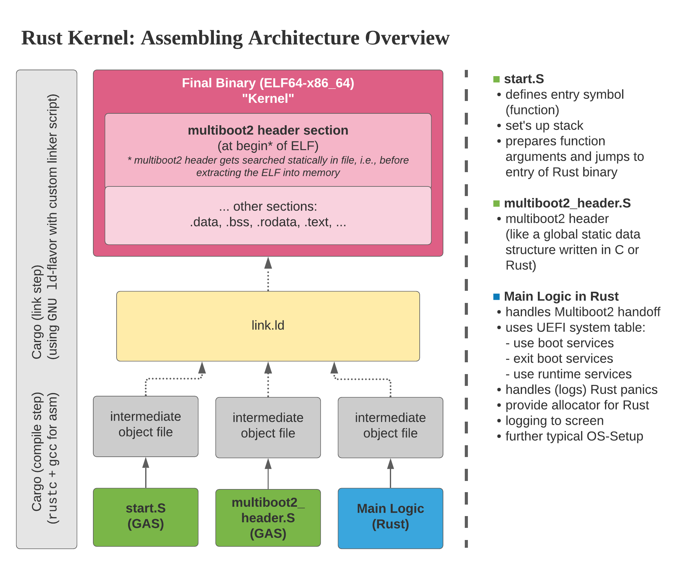

# Rust Multiboot2 Binary (Kernel) (x86_64)

This project builds a minimal `multiboot2`-compatible [[1]] binary (kernel) where the main logic is written in Rust. 
**"multiboot2"** refers to a specification [[1]] that defines the handoff from a bootloader to a payload. It has nothing
to do with "multiple OS boot environments"! The binary gets packaged as an `ELF64-x86_64`-file [[2]], that can be loaded 
by `GRUB` [[0]], a`multiboot2`-compliant bootloader. The demo project focuses on the **x86_64** processor architecture 
and `UEFI` as firmware environment.

## What this Project Builds

To be exact, the entry point into the kernel is written in assembly, but the logic is minimal and the handoff
to the code produced by the Rust compiler follows shortly. It's the responsibility of the Rust code, to cope with the 
`multiboot2` payload (**multiboot information structure**) and all the system setup. The final binary gets assembled 
from multiple object files: 

- `multiboot2_header.asm -> multiboot2_header.o` 
- `start.asm => start.o`
- static library build from Cargo project (written entirely in Rust)

The **GNU linker** `ld` uses the linker script in `src/linker.ld` and the object files to assemble the final ELF binary. 
Inside this repository you will find `build.sh` and `run_qemu.sh`, which enables you to "see" what's happening and to 
test everything. **There are plenty of comments in the shell scripts and the code, therefore this `README` only gives a 
high-level overview.**

The figure below gives you a comprehensive overview over the assembling of the final artefact, an `ELF64-x86_64`-file.



## How To Run

When you test this project (`run_qemu.sh`), it will
1) start QEMU + loads `edk2/OVMF` [[3]] as `UEFI`-environment [[4]] 
2) `OVMF` will automatically boot `GRUB` (an EFI file)
3) the `GRUB`-EFI-file has a `grub.cfg` file and the Rust binary built-in into the `GRUB`-internal `(memdisk)`-filesystem.
4) `GRUB` loads the cfg-file which starts the binary


With a boot-order of `firmware > GRUB > %my-binary%`, the binary could take the role of:
* another bootloader (multistage boot)
* an OS-Kernel written in Rust 
* an OS-specific loader which prepares hand-off to an OS-kernel (to decouple large software into smaller blocks of responsibility)

---

### Software/Tool versions 

- I tested the built on an Ubuntu 20.04 system with Linux 5.8.0
  - probably doesn't build on other platforms; it requires linkers that produce ELF files
- Rust-binary built using **Rust** `1.54-nightly`.
- `*.asm`-compilation compilation tested with **nasm** `2.14.02`
- linking the object files together was tested with **GNU ld** `2.34`
- "run in QEMU"-demonstration tested with
  - **GRUB**: 2.04-1ubuntu26.1
  - **QEMU**: 4.2.1

---

### System Environment & Processor Mode After Handoff

This section clarifies how the Rust kernel sees the environment after the binary was loaded, 
i.e., after `multiboot2` handoff. When `GRUB` is done loading our `ELF64-x86_64`-file, and our
application starts executing, a CPU core can subsequently execute the code. At this point we only have one single 
core (the *boot processor* (BP) available, that is running in `64-bit long mode`. We need further setup to boot 
up and use other cores eventually. 

*Side note: In Intel's manuals the "BP" is also called "bootstrap processor" (BSP).*

The kernel instructs the bootloader `GRUB` via a specific tag in the `multiboot2` header to give us the 
`AMD64`-machine state after handoff with `UEFI` boot services enabled. `AMD64` is a synonym for `x86_64` and the 
`AMD64` state is specified inside the `multiboot2` spec [[1]]. Further details get explained in the following
sections. Right before handoff, `GRUB` stores the pointer to the **multiboot information structure** in register `ebx` 
and a magic `multiboot2` number in `eax`. 


#### UEFI vs BIOS

For `multiboot2`-compliant binaries it's irrelevant whether the firmware
is a legacy `BIOS` or an `UEFI`-implementation. What's relevant is that the binary 
gets a `multiboot2` structure passed as payload, that contains multiple "tags".
A tag can for example contain the "memory map" of the `UEFI` [[1]]. 

Therefore, a "100% bullet proof" kernel should cope with two kinds of firmware (legacy BIOS and UEFI). In this
example, for the sake of simplicity and because legacy sucks, I only focus on `UEFI`. When our binary starts, the 
`UEFI boot time services` are still available. Consult the `UEFI`-spec for further information. This means, that it is 
up to our binary to exit the boot services eventually.


#### Processor Mode

The initial processor mode of the boot processor gets influenced at first by the platform and the underlying firmware. 
If your platform (mainboard/chipset) used legacy `BIOS`, the handoff from the firmware to the bootloader will happen in
`16-bit real mode`. If you use `UEFI` with `CSM` (compatibility support module) enabled, it will happen in 
`32-bit protected mode` [Intel® Platform Innovation for UEFI - CSM Specification: [5]]. If you have a modern
`UEFI`, the handoff takes place in either `32-bit protected mode` for `x86` processors or `64-bit long mode` for 
`x86_64` CPUs [Section 2.3.2/2.3.4 [4]].

`GRUB` is an `EFI`-application and runs as `64-bit code`. Because our prototype kernel only focuses on `x86_64` with 
`UEFI` and our `multiboot2` header instructs the bootloader to give us the `AMD64` state (alias for `x86_64`) [Section 3.5: [1]], `GRUB` 
is not required to do any action in this specific regard, because the boot processor is all the time in the correct mode. 

Furthermore, as specified in [Section 3.5 [1]/Section 2.3.4: [4]] interrupts are enabled as well as a few
other settings being made.

If we want to boot other cores eventually, we find background infos in  
[**Combined Volume Set of Intel® 64 and IA-32 Architectures Software Developer’s Manuals**/8.4 Multiple-Processor (MP) 
Initialization [6]]. This prototype doesn't implement this so far, but because it's interesting and not widely known,
I'd like to give a few details. The other cores are called *application processors* (APs) in Intel manuals and a
after a power-up or reset, the APs also complete a minimal self-configuration, and then wait for a startup signal 
(a *SIPI message*)[[6]] from the BP. Each AP can be addressed by
its unique *APIC ID* [[6]]. APIC stands for *Advanced Programmable Interrupt Controller* and is another specification.

This means each AP waits basically for an interrupt send by the BP. If the kernel follows the procedure described
in the manual [[6]], each core will **TODO will UEFI do something here? WIll the use the same UEFI page table etc?
Will they also be in 64-bit mode?**


*Side note: Theoretically `multiboot2` would give us a big benefit in this regard in legacy-boot environments
(or `UEFI` with `CSM`), because it could give us the `64-bit long mode`-state, which wouldn't be initially there.
We wouldn't have to make all the transitions by ourselves.*


#### Stack

I'm not 100% sure here. `UEFI` gives us a `128KiB` of stack according to the spec [[4]], but I think `GRUB` uses it 
already. Therefore, I define my own stack in `start.asm`, before the dispatch to the Rust binary happens. This way, we 
have enough stack for our needs, and the additional memory usage is negligible.

#### Memory

At the beginning all memory gets managed by the `UEFI` allocator, which is part of the boot services of `UEFI`.
I don't know the implementation details of `GRUB` but I'm confident they use reuse this allocator for their needs.
Our kernel also benefits from this allocator. Anyhow, we can't use it all the time. Eventually our kernel needs 
to exit the `UEFI` boot services and take full control over the system, including memory management. Because this 
is not implemented yet, this section may change in the future.

#### Summary Environment

The following figure summarizes the important boot flow and environment.


---

### Running & Debugging in Qemu
#### Running
`QEMU` itself has a `-kernel`-option to boot a `multiboot`-kernel. Unfortunately, this doesn't support `multiboot2` 
but we have a `multiboot2` binary/kernel here. Therefore, I took the approach of loading `edk2/OVMF` (`UEFI`) into 
`QEMU`, which itself loads the `GRUB`-binary. `GRUB` will finally load the `multiboot2` binary. The entry point will
be called, which is specified by the assembly code in `start.asm`.

#### Getting Output (in QEMU) & Debug
It's hard to get output because at this point we can't easily draw to GUI or print to STDOUT.. :)

##### Output & Debug A: Change Register Values and `halt`
You can write a value into a register and halt. In the QEMU GUI, you can open 
`View > compatmonitor0` and type `info registers`- you should see the register values!
Use this code for example:

```rust
unsafe { asm!("mov edi, {val}", "cli", "hlt", val = const 0x0bad_f00d_u32) };
```

##### Output & Debug B: Use QEMUs 'debugcon' Feature
- TODO, this section needs TODO (didn't work for me yet)
- Qemu has a debug port called "debug conn"
- with it, the application can use `out al, 0xe9` (x86 IO port)
- Qemu can map this debug connection to a file or stdout
- TODO add link from my blog

---

## Trivia/FAQ/Good to know/What I've learnt
- Q: Are OPCODES between 32-bit and 64-bit code different?
    - A: yes, I ran into this and learned it the hard way. If you execute 64-bit code in a 32-bit environment
         or vice versa, strange things will happen.
- `multiboot(2)` only specifies behavior for `x86` but not for other architectures, like ARM
- Q: Why is the Rust binary a static library and not an executable?
    - A: The final binary gets assembled from multiple object files. Code must be relocatable by the linker,
         otherwise (relative) jumps and loads may get damaged.

## Open Questions / TODO
- [x] Heap inside application?!
- [ ] move linker script into `x86_64-none-multiboot2_elf.json` (link args etc?!)
- [ ] How to ensure in Linker Script, that no code is mapped to address
      where UEFI stuff is stored?
- [ ] Debug and Prod build
- [ ] build a relocatable final binary to ensure that no code or data can overwrite uefi memory


## References
- **GRUB bootloader** \
  https://www.gnu.org/software/grub/
- **Multiboot2 spec** \
  https://www.gnu.org/software/grub/manual/multiboot2/
- **ELF spec** \
  https://refspecs.linuxfoundation.org/elf/elf.pdf
- **Tianocore/edk2** \
  https://github.com/tianocore/edk2
- **UEFI spec (2.9)** \
  https://uefi.org/sites/default/files/resources/UEFI_Spec_2_9_2021_03_18.pdf
- **Intel® Platform Innovation for UEFI - CSM Specification** \
  https://www.intel.com/content/dam/www/public/us/en/documents/reference-guides/efi-compatibility-support-module-specification-v098.pdf
- **Intel® Software Developer Manuals Overview** \
  https://software.intel.com/content/www/us/en/develop/articles/intel-sdm.html

[0]: https://www.gnu.org/software/grub/
[1]: https://www.gnu.org/software/grub/manual/multiboot2/
[2]: https://refspecs.linuxfoundation.org/elf/elf.pdf
[3]: https://github.com/tianocore/edk2
[4]: https://uefi.org/sites/default/files/resources/UEFI_Spec_2_9_2021_03_18.pdf
[5]: https://www.intel.com/content/dam/www/public/us/en/documents/reference-guides/efi-compatibility-support-module-specification-v098.pdf
[6]: https://software.intel.com/content/www/us/en/develop/articles/intel-sdm.html
